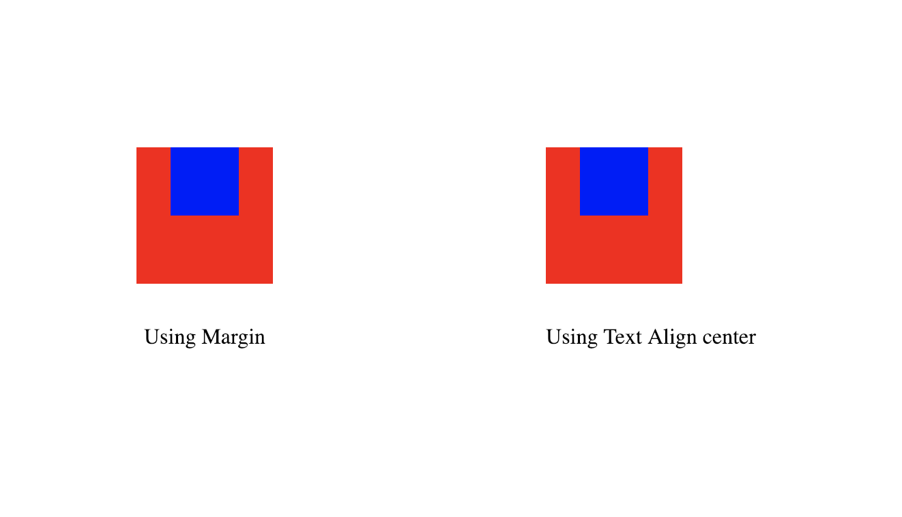
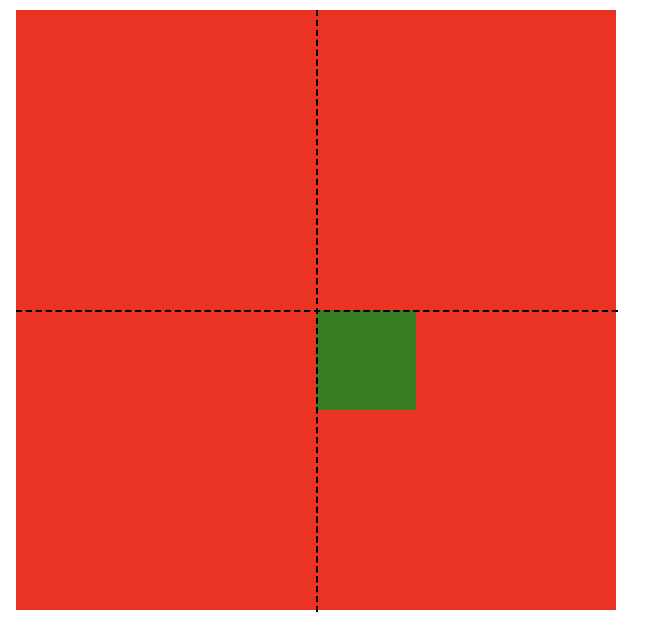
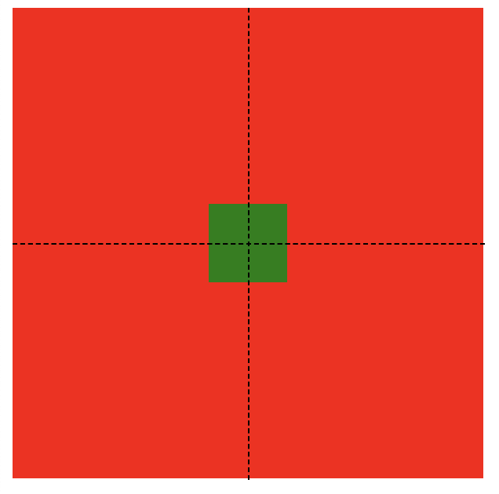

After giving a lot of frontend interviews and taking a few. I feel frontend interviews are the easiest to give and the hardest to take.

 Easiest to give, because there are very less questions which can be asked. And most of the them are standard. For e.g, explain closure, run to completion and questions around that. How `this` works. questions around prototype.

 And its Hardest to take because, based on such small problem set, it becomes difficult to judge whether a candidate is proficient in HTML, CSS and javascript.

 ---

And when it comes to css, the problem set decreases even further.  But the most asked css question is 

> *Center align a square inside another square, where both squares can be of variable length.*

I would discuss one way of solving the above problem, which will help us to understand the *position* and *translate* attributes in css.

## Center aligning and and why its difficult

*Center align = Horizontal center align + Vertical center align*

Horizontal center aligning is easy, but vertical center aligning becomes tricky.

For *horizontal center aligning*, you can use

```css
margin: 0 auto;
// or
text-align: center;
```



*Code for the above*

```html{2,6,7}
<div class="big-square">
  <div class="small-square m-auto">
  </div>
</div>

<div class="big-square text-center">
  <div class="small-square display-ib">
  </div>
</div>
```

```css
.big-square {
  width: 100px;
  height: 100px;
  background-color: red;
  margin-bottom: 30px;
}

.text-center {
  text-align: center;
}

.small-square {
  width: 50px;
  height: 50px;
  background-color: blue;
}

.m-auto {
  margin: 0 auto;
}

.display-ib {
  display: inline-block;
}
```

https://codepen.io/pruthvip/pen/XoZMrg?editors=1100

---
### Vertical center alignment

```css
vertical-align: middle;
```

The above code can middle align *table-cells* and *inline-block* elements. But to achieve this you need to make some changes in the structure of your html code and css, which can be cumbersome.

---

Hence one of the easiest way to center align things is to use the *position* attribute.

## Center aligning using position attribute
There are 4 values for the position attribute
* **static**

By default all elements are static. Nothing special about it. Attributes like *top*, *left*, *z-index* have no effect on this.
* **relative**

Similar to static. Element will be positioned in the normal position according to the html structure. But *top*, *left* etc gets applied on these element. And the reference will be the **original position according to the html flow**.
* **absolute**

Similar to relative, just that the reference from where *top*, *left* will be calculated , will be the **nearest *non-static* parent**(can be *relative*, *absolute* or any other non-static property)

* **fixed**
* **sticky**

You won't be needing the above 2 for center aligning, but you can read more about them [here](https://developer.mozilla.org/en-US/docs/Web/CSS/position)

---

Hence using the above definition. The easiest way to center align would be to.

```html
  <div class="parent">
    <div class="child">
    </div>
  </div>
```

```css{2,9,10,11}
.parent {
  position: relative;
  width: 100px;
  height: 100px;
}

.child {
  position: absolute;
  top: 50%;
  left: 50%;
  width: 50px;
  height: 50px;
}
```

The output of the code is like the image below. Here the dotted lines are for reference.



As you can see. The top left corner of the inner square is in the middle of the outer rectangle.

But this is not, what we wanted. We wanted the center of the inner square to be at the centre of the outer rectangle.

Hence to get the inner square at the center. 

* We need to shift the square up **by half of its width**.
* We need to shift the square left **by half of its width**.

If we know the width of the inner square. Then we can use the css property `calc`, which is a very powerful property as it can do arithmetic operations between a percentage value and a fixed value in run time.


```css{3,4}
.child {
  position: absolute;
  top: calc(50% - 25px);
  left: calc(50% - 25px);
  width: 50px;
  height: 50px;
}
```

Awesome. We have solved it. But if you look at the problem, It says the square can be of variable length. The size of the inner square might change at run time. Hence if the width of the square becomes 100px. Then the alignment will go for a toss. Hence we a need a more generic solution.

>**transform** and **translate** comes to rescue here.

`transform` is a css property which helps to rotate, translate, scale ... an element in the dom.

The trick to solve the given problem, is to `translate` an element using percentage values.

When percentage value are given, they depend on the height and width of the element on which the `translate` property is applied.

`translate` takes 2 values. One for the `x` axis and one for the `y` axis.

```css{3,4}
.child {
  position: absolute;
  top: 50%;
  left: 50%;
  width: 50px;
  height: 50px;
  transform: translate(-50%, -50%); // translate(`X axis value`, `Y axis value`); 
}
```

Lets decode the above code now. What does `50%` in the `translate` mean here. As mentioned above, percentage values in translate depend on the element they are getting applied to.
>Hence 50% will be `50px/2` => `25px`, where 50px is the width of the inner child element.

Hence
* We are translating the inner square in the negative x direction i.e to the left by 25px.
* We are translating the inner square in the negative y direction i.e to the top by 25px.

The above 2 steps is what we needed to center align the inner square.
Hence even if the dimensions of the inner square changes at run time, the translate will take care to align the inner square at the middle.




>Its at the center now !!!!