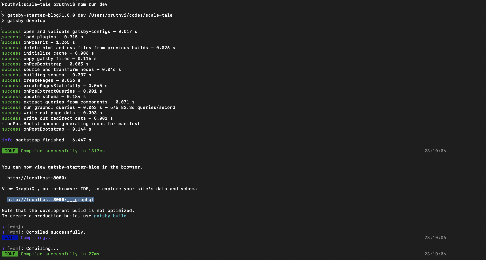
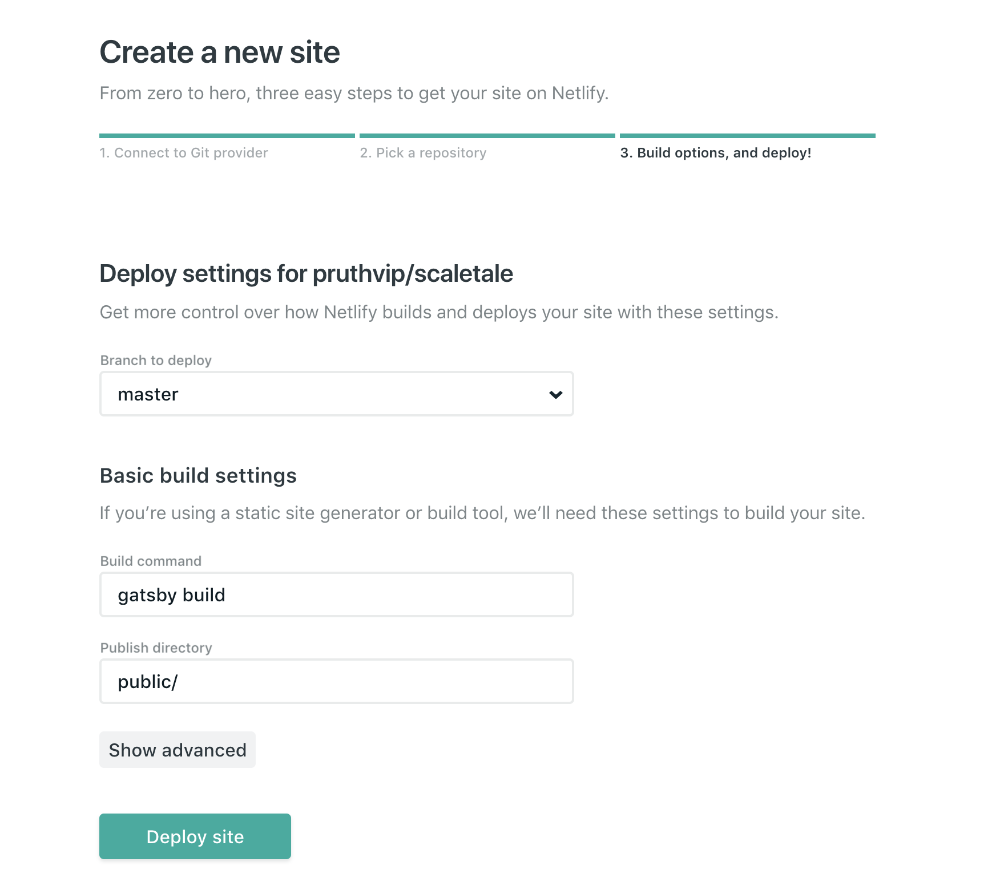
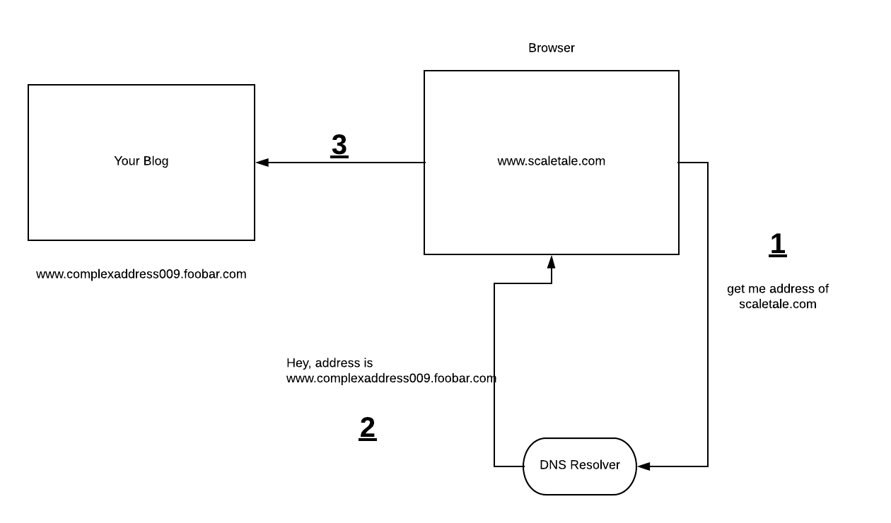

I always wanted to write and host a blog. Took almost 2 years to do so. This post is about how you can start and host a simple blog in the cheapest way possible.

##3 important ingredients to start/host a blog
The following 3 ingredients are the basic stuffs which you will need to get started with any blog.

* Content and the easiest way to write it.
* A place on the internet to keep your content.
* An easy human readable address to the above place.

###Content and the easiest way to write it.
There are many softwares/platforms which help you write content. For e.g wordpress, django, gatsby and you can even write from scratch using vanila html css.

I have used [gatsby](https://www.gatsbyjs.org/) to write this blog. It's a static site generator. Super easy to use. Just choose any of the [gatsby starters](https://www.gatsbyjs.org/starters/?v=2) you like and install and start writing.

I have used a basic gatsby [template](https://www.gatsbyjs.org/starters/gatsby-starter-blog/). All I had to do is

    npm i -g gatsby // install gatsby globally
    gatsby new scale-tale https://github.com/gatsbyjs/gatsby-starter-blog   // get the gatsby starter code
    cd scale-tale && npm i && npm run dev   // install node dependencies and run the code

###A place on the internet to keep your content.
Now your content is sorted. Now you need a place to store it. Since you cant keep your laptop always on and connected to the internet. Its good if you put your content to some hosting service, so your content is always available. Some examples of the hosting services are AWS, GCP, Digital Ocean, Hostgator etc.

If you just want to host static content (html css and some js), [github](https://github.com/) and [netlify](https://netlify.com/) provides free hosting. Since gatsby converts the blog into static contents. This was my best option, because it was totally free. I tried both github pages and netlify. Found netlify is much more easier to use and way too cooler. And it has inbuilt support for gatsby and it recognizes if your blog is written in gatsby.

Just upload your code to github. And integrate it on netlify.

###An easy human readable address to the above place.
https://frosty-hodgkin-35337a6.netlify.com => Netlify usually provides an address to your hosting place is this format. Not very human friendly.
Hence you need a simpler address. This is where Domain Name providers come into picture.

Domain Name providers like godaddy, hostgator, bigrock are companies where you can choose a good name/address for your site, for e.g www.scaletale.com. And whenever anyone in the world types that address in his/her browser, domain name providers give back the real address (DNS resolution) of the place where your content is stored.

For this you have map the netlify server's address in your domain name providers portal. Just google <strong>how to add cname and a records in godaddy|hostagtor|</strong>.

Netlify have documented all the steps in a very nice way. It will hardly take you more than 30 minutes configure it. It usaully to takes some time (24 hours) for the DNS change to reflect.

<strong>In the whole setup for this blog, I only had to pay for the domain name, which came around 700 INR for a year.</strong>
